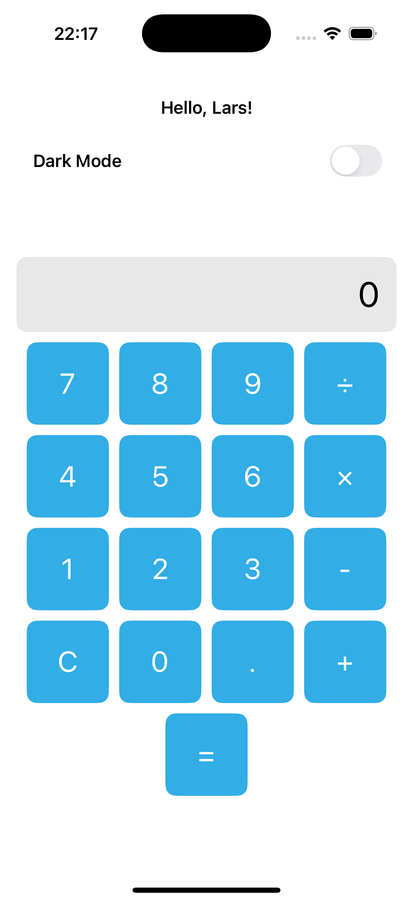
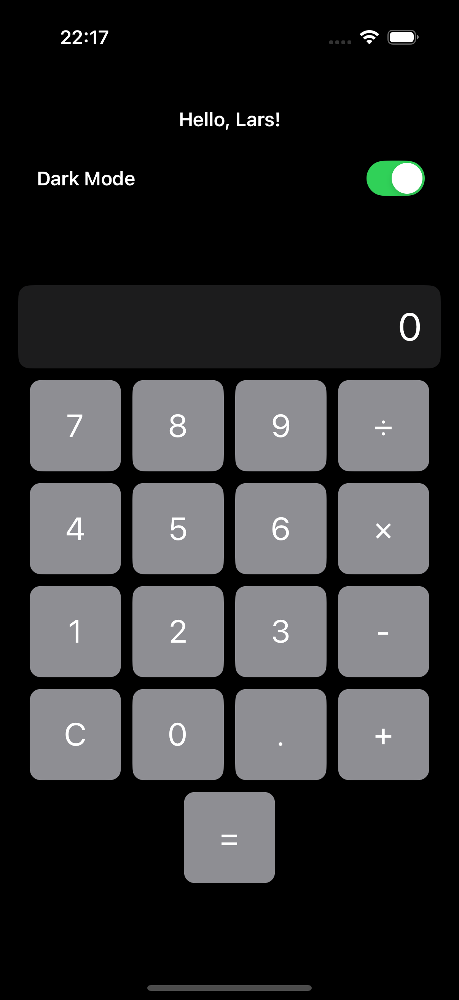

# Calculator App

A simple and elegant calculator app built with SwiftUI. This app supports basic arithmetic operations, a dark mode toggle, and personalized greetings for users.

## Features

- **Basic Arithmetic Operations**: Addition, subtraction, multiplication, and division.
- **Dark Mode Support**: Switch between light and dark themes.
- **Personalized Greetings**: Users can enter their name to get a personalized welcome message.
- **Decimal Support**: Perform calculations with decimal numbers.
- **Responsive Design**: Optimized for different screen sizes.

## Screenshots

| Light Mode                           | Dark Mode                           |
|--------------------------------------|-------------------------------------|
|  |  |


## Getting Started

Follow these instructions to set up and run the project on your local machine.

### Prerequisites

- macOS with Xcode installed (version 14 or higher).
- Basic knowledge of Swift and SwiftUI.

### Installation

1. Clone the repository:
   ```bash
   git clone https://github.com/your-username/calculator-app.git
